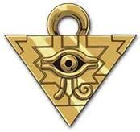

# Yu-Gi-Oh! Card Price Tracker 


## Overview
  Yu-Gi-Oh! Card Price Tracker allows users to enter Yu-Gi-Oh cards by their SetID (for example DUNE-EN069) and add them to a list, then they can also track the average price of this card using real-time data fetching from an API.

## Features

- **User-Friendly Interface**: Simple layout with easy navigations and interaction.
- **Search Functionality**: Users can enter a card's Set ID (e.g., DUNE-EN056) to add specific cards to their list.
- **Add and Manage Cards**: Users can add and remove cards as needed with ease.
- **Price Tracking**: Display the average price of cards fetched from the YGOProDeck API which uses TCGPlayer for their card prices.
- **Continuous Storage**: Card data is stored in the browser's localStorage, allowing users to retain their collection across sessions.
- **Reactive Design**: Works well on both mobile devices and desktops.

## Installation
How to set up program locally:
1. **Clone the repository**:
   ```bash
   git clone https://github.com/username/Yu-Gi-Oh-Card-Tracker.git
   cd Yu-Gi-Oh-Card-Tracker
2. Open the HTML file index.html in your web browser.

## How to Use
1. Enter a card's Set ID into the search field and click the Add Button.
2. If the card is found or exists, the card will be added to your collection list.
3. Once a card is there on the right its average price will be displayed.
4. To remove a card from the list hit the x button next to the card name.
5. The card list and prices and stored locally in your browser.

## Technology Used
  - HTML
  - CSS
  - JavaScript
  - Fetch API
  - LocalStorage

## API Reference
  - The Yu-Gi-Oh! Card Price Tracker uses the YGOProDECK API to get its card information and prices.

## Contributing
  - I will continue to improve upon this web application as I bring merge passions, but feel free to mess around with it yourself and if you have suggestions or improvements create a pull request.
